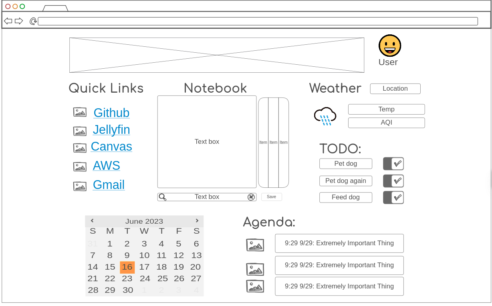

# Fall 2025 CS260 Startup

Garrett Southam

garrettsoutham@proton.me

## Startup Specification

### Elevator Pitch

My goal is to create a personalized Homepage that is a useful first-stop when you open your browser. It will feature quick links to all the sites you use the most, as well as personalized live tools like a personal notebook, todo list, and agenda. My Homepage is designed to be a one-stop shop for the things I do the most online. This is a personal project that I can take away from this class and continue to use and develop in a legitimately useful way. Maybe it will even be useful to others!

### Description of Key Features

- **Quick Links**: A section for quick access to frequently visited websites, customizable by the user.
- **Personal Notebook**: A simple text area for taking notes, with options to save and organize them.
- **To-Do List**: A checklist feature for managing tasks and reminders.
- **Agenda**: A calendar view for scheduling events and deadlines.
- **Weather Widget**: A small section displaying current weather information.

### Technologies to be Used

- **HTML/CSS**: For structuring and styling the homepage. Provides the semantic layout and theming.
- **JavaScript**: For interactivity and dynamic content.
- **React**: To build a responsive and modular user interface.
- **Web Service (Backend API)**: A simple API to handle authentication and CRUD links for the tasks, notes, calendar, etc.
- **Database**: To store user accounts and all user data (links, notes, tasks, events, layouts, etc.)
- **WebSocket (Realtime)**: To push live changes like task completion, saving notes, etc.
- **External APIs**: For fetching weather data and possibly integrating with other services (e.g., Google Calendar).

### Rough Sketch

